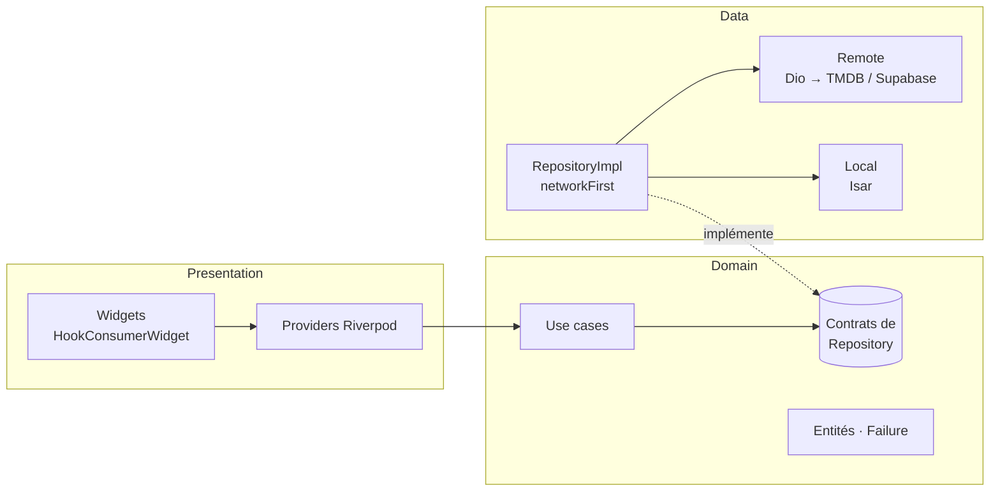
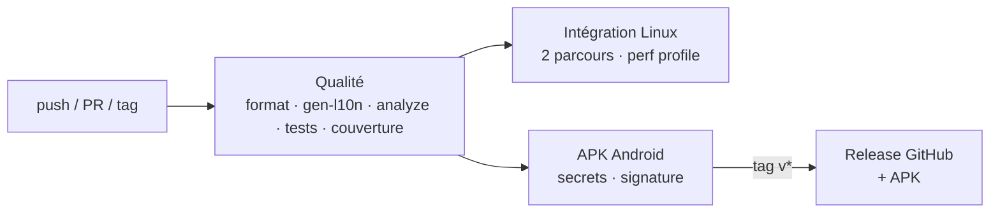

# Cinéthèque

[](https://github.com/angekougo/flutter_app_production_ready/actions/workflows/ci.yml)


[](https://github.com/angekougo/flutter_app_production_ready/releases/latest)

> Application mobile Flutter de découverte de films — **TMDB**, **Supabase Auth**,
> **cache Isar hors ligne** — portée au niveau **production** : testée de bout en
> bout, mesurée à 60 fps, accessible, bilingue, livrée par CI/CD.

Projet final de la certification **« Flutter — App production-ready testée et
optimisée »**, construit à partir de [Cinéthèque 1.0](https://github.com/angekougo/cinetheque)
(certification « App connectée avec backend réel »).

**📱 [Télécharger l'APK de démonstration](https://github.com/angekougo/flutter_app_production_ready/releases/latest)**

| Accueil | Fiche film | Recherche | Favoris | Profil |
|:---:|:---:|:---:|:---:|:---:|
|  |  |  |  |  |

<sub>Captures générées depuis l'application réelle (thème, polices, traductions),
avec un backend de démonstration : les affiches TMDB y sont remplacées par leurs
vignettes colorées. Voir [Captures d'écran](#11-commandes).</sub>

---

## Sommaire

1. [Exigences du projet](#1-exigences-du-projet)
2. [Fonctionnalités](#2-fonctionnalités)
3. [Architecture](#3-architecture)
4. [Tests](#4-tests)
5. [Performance](#5-performance)
6. [Accessibilité](#6-accessibilité)
7. [Internationalisation](#7-internationalisation)
8. [CI/CD](#8-cicd)
9. [Préparation à la production](#9-préparation-à-la-production)
10. [Installation](#10-installation)
11. [Commandes](#11-commandes)
12. [Limites connues](#12-limites-connues)
13. [Annexe — Vérification des exigences](#annexe--vérification-des-exigences-fichiers-lignes-et-code)

---

## 1. Exigences du projet

Chaque exigence du sujet, avec sa preuve principale (lien direct vers les lignes de code). Le **détail** — fichiers, numéros de ligne et aperçu du code pour chaque exigence — est en [annexe](#annexe--vérification-des-exigences-fichiers-lignes-et-code).

<!-- REFS:SUMMARY:START -->
<!-- Généré par `dart run tool/readme_refs.dart` : ne pas modifier à la main. -->

| # | Exigence du projet | Preuve principale | Détail |
|---:|---|---|:---:|
| 1 | Application fonctionnelle avec au moins 5 écrans | [`app_router.dart` L54 … L136 (10 lignes)](lib/app/router/app_router.dart#L54) | [✅ voir](#a1-application-fonctionnelle-avec-au-moins-5-écrans) |
| 2 | Au moins 10 tests unitaires (logique métier, providers, repositories) | [`movie_repository_impl_test.dart` L91 … L318 (15 lignes)](test/features/movies/movie_repository_impl_test.dart#L91) | [✅ voir](#a2-au-moins-10-tests-unitaires-logique-métier-providers-repositories) |
| 3 | Au moins 5 tests de widgets | [`home_page_test.dart` L71 … L145 (4 lignes)](test/features/home/home_page_test.dart#L71) | [✅ voir](#a3-au-moins-5-tests-de-widgets) |
| 4 | Au moins 2 tests d’intégration | [`app_journeys_test.dart` L11, L13, L18](integration_test/app_journeys_test.dart#L11) | [✅ voir](#a4-au-moins-2-tests-dintégration) |
| 5 | Performance : aucun jank visible (60 fps constant) | [`scroll_performance_test.dart` L28–49](integration_test/scroll_performance_test.dart#L28-L49) | [✅ voir](#a5-performance--aucun-jank-visible-60-fps-constant) |
| 6 | Performance : images optimisées et lazy-loadées | [`api_constants.dart` L25–30](lib/core/network/api_constants.dart#L25-L30) | [✅ voir](#a6-performance--images-optimisées-et-lazy-loadées) |
| 7 | Performance : pas de rebuilds inutiles (flutter_hooks ou const) | [`register_page.dart` L198–207](lib/features/auth/presentation/pages/register_page.dart#L198-L207) | [✅ voir](#a7-performance--pas-de-rebuilds-inutiles-flutter_hooks-ou-const) |
| 8 | Accessibilité : semantic labels sur les éléments interactifs | [`poster_card.dart` L70–72](lib/shared/widgets/poster_card.dart#L70-L72) | [✅ voir](#a8-accessibilité--semantic-labels-sur-les-éléments-interactifs) |
| 9 | Internationalisation : support FR + EN minimum | [`l10n.yaml` L1–5](l10n.yaml#L1-L5) | [✅ voir](#a9-internationalisation--support-fr--en-minimum) |
| 10 | CI/CD configuré (GitHub Actions) avec lint + tests automatiques | [`ci.yml` L3–8](.github/workflows/ci.yml#L3-L8) | [✅ voir](#a10-cicd-configuré-github-actions-avec-lint--tests-automatiques) |
| 11 | Analyse statique sans warnings (`flutter analyze` propre) | [`analysis_options.yaml` L14–16](analysis_options.yaml#L14-L16) | [✅ voir](#a11-analyse-statique-sans-warnings-flutter-analyze-propre) |
| 12 | README professionnel : architecture, setup, captures d’écran, badges CI | [`screenshots_test.dart` L152 … L191 (7 lignes)](tool/screenshots/screenshots_test.dart#L152) | [✅ voir](#a12-readme-professionnel--architecture-setup-captures-décran-badges-ci) |
| 13 | CHANGELOG.md avec au moins 3 versions documentées | [`CHANGELOG.md` L8, L58, L80](CHANGELOG.md?plain=1#L8) | [✅ voir](#a13-changelogmd-avec-au-moins-3-versions-documentées) |
| 14 | Livraison : repo GitHub public avec CI verte, README complet et APK de démonstration | [`ci.yml` L197–213](.github/workflows/ci.yml#L197-L213) | [✅ voir](#a14-livraison--repo-github-public-avec-ci-verte-readme-complet-et-apk-de-démonstration) |
<!-- REFS:SUMMARY:END -->

## 2. Fonctionnalités

| Écran | Contenu | Données |
|---|---|---|
| **Démarrage** | Restaure la session, redirige vers l'accueil ou la connexion | Supabase (session locale chiffrée) |
| **Connexion / Inscription** | Validation, jauge de robustesse, confirmation, erreurs traduites | Supabase Auth |
| **Accueil** | N°1 des tendances, Populaires, Nouveautés, Tendances, filtres par genre | TMDB → cache Isar |
| **Tout voir** | Grille paginée à défilement infini | TMDB → cache Isar |
| **Recherche** | Anti-rebond, pagination, recherches récentes | TMDB → cache Isar |
| **Fiche film** | Sortie, durée, note, popularité, genres, synopsis, casting, similaires, favori | TMDB → cache Isar |
| **Fiche acteur** | Portrait, naissance, biographie, filmographie | TMDB → cache Isar |
| **Favoris** | Grille, retrait avec « Annuler », disponibles hors ligne | Isar, par utilisateur |
| **Profil** | Compte, session (expiration du JWT), données hors ligne, **langue**, déconnexion | Supabase REST (Dio + JWT) + Isar |

**Hors ligne** : stratégie « réseau d'abord, cache en secours » ; tout ce qui a été
consulté reste disponible, avec une bannière et la date de mise à jour.

## 3. Architecture

**Clean Architecture feature-first** : chaque fonctionnalité a ses couches
`data` / `domain` / `presentation`. Le domaine est en Dart pur et **ne contient
aucun texte affiché** (les erreurs sont des types, traduits par la présentation).



```text
lib/
├── main.dart               # .env, polices embarquées, Supabase, Isar, préférences
├── app/                    # Thème, routeur (GoRouter + garde de session), polices
├── core/
│   ├── error/              # AppException → Failure (types, sans texte)
│   ├── l10n/               # Langue choisie / appareil, résolution FR-EN
│   ├── network/            # Dio, intercepteurs TMDB (langue) et JWT, tailles d'images
│   ├── repository/         # Stratégie networkFirst réutilisée partout
│   └── storage/            # Isar, session chiffrée
├── features/{auth,home,movies,actors,favorites,profile}/
│   ├── data/               # DataSources, modèles, RepositoryImpl
│   ├── domain/             # Entités, contrats, use cases
│   └── presentation/       # Providers, pages, widgets
├── l10n/                   # app_fr.arb (modèle), app_en.arb + code généré
└── shared/                 # Widgets (StarText, PosterCard…), extensions (l10n, images)
```

| Brique | Rôle |
|---|---|
| **Riverpod 3 + hooks_riverpod** | Injection de dépendances, état, `select` pour des reconstructions ciblées |
| **flutter_hooks** | État local des widgets (contrôleurs, animations) sans `StatefulWidget` |
| **GoRouter** | Onglets persistants, redirection automatique selon la session |
| **Dio** | Client TMDB (clé applicative, langue) et client Supabase (JWT + refresh) |
| **Isar** | Cache hors ligne et favoris |
| **flutter_localizations / intl** | Traductions ARB, pluriels, formats de nombres et de dates |

## 4. Tests

| Type | Nombre | Contenu |
|---|---:|---|
| Unitaires | 87 | Validateurs, repositories (réseau/cache/erreurs), intercepteur JWT, contrôleur de recherche, traductions et formats, langue, tailles d'images, contraste WCAG |
| Widgets | 39 | Écrans (états chargement/succès/hors ligne/erreur), accessibilité, reconstructions, changement de langue |
| Intégration | 3 | 2 parcours utilisateur + 1 mesure de performance, sur l'app complète |

**140 cas exécutés** par `flutter test` (certains tests sont paramétrés), **81 %
de couverture** hors code généré. Les parcours d'intégration sont aussi rejoués
en temps simulé dans `flutter test` ([`test/e2e/`](test/e2e)).

Les tests d'intégration lancent la **vraie application** (routeur, thème,
traductions) avec un **backend en mémoire** ([`fake_backend.dart`](integration_test/support/fake_backend.dart)) :
reproductibles, sans réseau ni compte.

1. **Favori** : mauvais mot de passe → erreur ; bon mot de passe → accueil →
   fiche du n°1 → ajout aux favoris → onglet Favoris → retrait → « Annuler ».
2. **Recherche, langue, déconnexion** : session restaurée → recherche avec
   anti-rebond (un seul appel) → fiche → Profil → anglais → déconnexion.

## 5. Performance

### Mesures (CI, mode profile, défilement de l'accueil et d'une grille de 60 affiches)

<!-- PERF:START -->
| Mesure | Résultat | Budget 60 fps |
|---|---:|---:|
| Images analysées | 350 | — |
| Construction moyenne | **1,89 ms** | 16 ms |
| 90ᵉ centile | **4,55 ms** | < 16 ms |
| 99ᵉ centile | **6,72 ms** | — |
| Images hors budget | **0** | < 5 % |

<sub>Run CI du commit `57d56c3`. Mesures republiées à chaque exécution dans le résumé du job
« Tests d'intégration (Linux) » ([exécutions](https://github.com/angekougo/flutter_app_production_ready/actions/workflows/ci.yml)).</sub>
<!-- PERF:END -->

Le test échoue si le **90ᵉ centile du temps de construction dépasse 16 ms** ou si
**plus de 5 % des images** dépassent le budget d'une image à 60 fps.

### Reconstructions (mesurées par [`rebuilds_test.dart`](test/performance/rebuilds_test.dart))

| Situation | Avant | Après | Technique |
|---|---:|---:|---|
| Saisie à l'inscription (écran reconstruit) | 3 | **0** | Hooks ; seuls la jauge et la confirmation écoutent les champs |
| Saisie dans la recherche | 1 / caractère | **0** | Bouton « Effacer » et aide abonnés au champ seulement |
| Rafraîchissement du JWT (accueil) | 1 | **0** | `select` sur le prénom + égalité par valeur (`Fetched`, `HomeOverview`) |
| Pulsation des squelettes (60 fps) | 60 builds/s/bloc | **0** | `FadeTransition` + `RepaintBoundary` |
| Horloge du Profil (30 s) | écran entier | **3 valeurs** | Widget `_Clocked` isolé |

### Images

- Taille TMDB choisie selon les **pixels réellement affichés** (`w154` → `w500`
  pour les affiches, `w300` → `w1280` pour les fonds).
- Décodage à la taille affichée (`memCacheWidth` = largeur × densité d'écran).
- Cache disque (`cached_network_image`) et listes construites à la demande
  (`ListView.builder`, `SliverGrid.builder`), y compris le casting complet.

Et partout : widgets `const` imposés par le lint (`prefer_const_*`,
`use_colored_box`, `use_decorated_box`…).

## 6. Accessibilité

- **Libellés** : chaque affiche, carte ou membre du casting est **un bouton** au
  résumé explicite — « *Marée Basse, 2024, Thriller, note 7,9 sur 10* » — sans
  doublon ni symbole lu tel quel.
- **Structure** : titres d'écrans et de sections déclarés comme en-têtes ;
  bannière hors ligne en zone live ; état du favori (activé / désactivé) ;
  chargement annoncé.
- **Cibles tactiles** ≥ 48 dp ; libellés courts sur une ligne.
- **Contraste** : toutes les couleurs de texte ≥ 4,5:1 (WCAG AA) sur tous les
  fonds — minimum 5,2:1 ([`color_contrast_test.dart`](test/a11y/color_contrast_test.dart)).
- **Vérifié** par les règles d'accessibilité de Flutter sur 6 écrans et par des
  tests des libellés en français et en anglais ([`test/a11y/`](test/a11y)).

## 7. Internationalisation

- **Français et anglais** : [`app_fr.arb`](lib/l10n/app_fr.arb) (modèle) et
  [`app_en.arb`](lib/l10n/app_en.arb), code généré par `flutter gen-l10n`.
- **Pluriels et accords en ICU** : « 1 résultat / 12 résultats »,
  « NÉE / NÉ / NÉ·E LE … ».
- **Formats selon la langue** : 7,9 / 7.9 ; 12.03.24 / 03/12/24 ; « il y a 5 min » / « 5 min ago ».
- **Langue de l'appareil par défaut**, choix persistant dans le Profil ; les
  **contenus TMDB** (titres, synopsis, genres) suivent la langue.
- Le domaine ne contient aucun texte : erreurs et validations sont des types,
  traduits dans [`l10n_x.dart`](lib/shared/extensions/l10n_x.dart).

## 8. CI/CD



| Job | Étapes |
|---|---|
| **Qualité** | `dart format --set-exit-if-changed`, traductions générées à jour, `flutter analyze --fatal-infos --fatal-warnings`, `flutter test --coverage` (résumé de couverture) |
| **Intégration (Linux)** | Parcours sur bureau Linux (xvfb) puis `flutter drive --profile` pour la performance (résumé JSON en artefact et en annotation) |
| **APK Android** | `.env` et keystore injectés depuis les **secrets** du dépôt, `flutter build apk --release`, APK en artefact ; release GitHub sur les tags `v*` |

Les échecs sont publiés en **annotations** ([`tool/ci/run.sh`](tool/ci/run.sh)) :
l'erreur se lit depuis la page du run.

## 9. Préparation à la production

- **Secrets hors du code** : `.env` ignoré par git ; la CI le reconstruit depuis
  les secrets `TMDB_READ_TOKEN`, `SUPABASE_URL`, `SUPABASE_PUBLISHABLE_KEY`. Seules
  des clés **publiques** côté client (jeton TMDB en lecture, clé *publishable*
  Supabase, protégée par RLS) sont embarquées.
- **Android** : permission `INTERNET` déclarée pour la release, identifiant
  `io.github.angekougo.cinetheque`, signature de release via `key.properties`
  (secrets `ANDROID_KEYSTORE_BASE64`, `ANDROID_KEYSTORE_PASSWORD`,
  `ANDROID_KEY_ALIAS`, `ANDROID_KEY_PASSWORD`).
- **Polices embarquées** avec leurs licences OFL : aucun téléchargement au
  premier lancement, affichage identique hors ligne.
- **Session** chiffrée (Keystore / Keychain), JWT rafraîchi automatiquement.

## 10. Installation

**Prérequis** : Flutter 3.47+ (Dart 3.13+), un appareil ou émulateur Android/iOS.

```bash
git clone https://github.com/angekougo/flutter_app_production_ready.git
cd flutter_app_production_ready
cp .env.example .env    # puis renseigner les trois clés
flutter pub get
flutter run
```

| Variable `.env` | Où la trouver |
|---|---|
| `TMDB_READ_TOKEN` | themoviedb.org → Paramètres → API → *Jeton d'accès en lecture* |
| `SUPABASE_URL` | Supabase → Project Settings → Data API |
| `SUPABASE_PUBLISHABLE_KEY` | Supabase → Project Settings → API Keys (`sb_publishable_…`) |

## 11. Commandes

```bash
flutter analyze                          # analyse statique
flutter test --coverage                  # tests unitaires et de widgets
flutter test integration_test -d <appareil>   # parcours de bout en bout

# Performance (mesures fiables uniquement en mode profile)
flutter drive --profile --driver=test_driver/perf_driver.dart \
  --target=integration_test/scroll_performance_test.dart -d <appareil>

# Captures d'écran du README (docs/screenshots)
flutter test tool/screenshots --update-goldens

flutter gen-l10n                         # après modification des fichiers .arb
dart run build_runner build              # après modification des modèles Isar
```

## 12. Limites connues

- **iOS** : non signé ni distribué (pas de compte Apple Developer) ; le code est
  compatible, seul l'APK Android est livré.
- **Cache et langue** : les données en cache gardent la langue dans laquelle
  elles ont été téléchargées, jusqu'à leur prochain rafraîchissement en ligne.
- **Mesures de performance** effectuées sur le bureau Linux de la CI (rendu
  logiciel) : elles valident le temps de construction des images ; le temps de
  rendu GPU se vérifie sur appareil (DevTools, mode profile).

---

## Annexe — Vérification des exigences (fichiers, lignes et code)

Chaque exigence est reprise **telle qu’énoncée** dans le sujet, suivie des **fichiers et numéros de ligne** qui la réalisent (liens cliquables) puis d’un **aperçu du code**, numéroté comme dans le fichier.

> Annexe **générée** par [`tool/readme_refs.dart`](tool/readme_refs.dart) à partir du code : les extraits sont repérés par leur contenu, les numéros de ligne et les nombres de tests sont calculés, et la CI échoue si l’annexe n’est plus à jour. Les références correspondent donc toujours au code.

<!-- REFS:START -->
<!-- Généré par `dart run tool/readme_refs.dart` : ne pas modifier à la main. -->

### A1. Application fonctionnelle avec au moins 5 écrans

**10 écrans**, déclarés dans le routeur GoRouter (onglets persistants et redirection selon la session). Tous les écrans sont des widgets Riverpod ; ceux qui ont un état local utilisent des hooks.

| Fichier | Lignes | Rôle |
|---|---|---|
| [`lib/app/router/app_router.dart`](lib/app/router/app_router.dart#L54) | L54, L58, L62, L76, L87, L101, L109, L117, L128, L136 | Les 10 routes et leur écran |
| [`lib/features/auth/presentation/pages/splash_page.dart`](lib/features/auth/presentation/pages/splash_page.dart#L18) | L18 | Déclaration de l’écran — `class SplashPage extends HookConsumerWidget {` |
| [`lib/features/auth/presentation/pages/login_page.dart`](lib/features/auth/presentation/pages/login_page.dart#L20) | L20 | Déclaration de l’écran — `class LoginPage extends HookConsumerWidget {` |
| [`lib/features/auth/presentation/pages/register_page.dart`](lib/features/auth/presentation/pages/register_page.dart#L26) | L26 | Déclaration de l’écran — `class RegisterPage extends HookConsumerWidget {` |
| [`lib/features/home/presentation/pages/home_page.dart`](lib/features/home/presentation/pages/home_page.dart#L26) | L26 | Déclaration de l’écran — `class HomePage extends ConsumerWidget {` |
| [`lib/features/movies/presentation/pages/movie_list_page.dart`](lib/features/movies/presentation/pages/movie_list_page.dart#L19) | L19 | Déclaration de l’écran — `class MovieListPage extends ConsumerWidget {` |
| [`lib/features/movies/presentation/pages/search_page.dart`](lib/features/movies/presentation/pages/search_page.dart#L24) | L24 | Déclaration de l’écran — `class SearchPage extends HookConsumerWidget {` |
| [`lib/features/movies/presentation/pages/movie_details_page.dart`](lib/features/movies/presentation/pages/movie_details_page.dart#L30) | L30 | Déclaration de l’écran — `class MovieDetailsPage extends ConsumerWidget {` |
| [`lib/features/actors/presentation/pages/actor_details_page.dart`](lib/features/actors/presentation/pages/actor_details_page.dart#L26) | L26 | Déclaration de l’écran — `class ActorDetailsPage extends ConsumerWidget {` |
| [`lib/features/favorites/presentation/pages/favorites_page.dart`](lib/features/favorites/presentation/pages/favorites_page.dart#L19) | L19 | Déclaration de l’écran — `class FavoritesPage extends ConsumerWidget {` |
| [`lib/features/profile/presentation/pages/profile_page.dart`](lib/features/profile/presentation/pages/profile_page.dart#L19) | L19 | Déclaration de l’écran — `class ProfilePage extends ConsumerWidget {` |

**[`lib/app/router/app_router.dart`](lib/app/router/app_router.dart#L54)** · L54, L58, L62, L76, L87, L101, L109, L117, L128, L136 — Les 10 routes et leur écran

```dart
 54  builder: (context, state) => const SplashPage(),
     ⋮
 58  builder: (context, state) => const LoginPage(),
     ⋮
 62      builder: (context, state) => const RegisterPage(),
     ⋮
 76          builder: (context, state) => const HomePage(),
     ⋮
 87              builder: (context, state) => MovieListPage(
     ⋮
101          builder: (context, state) => const SearchPage(),
     ⋮
109          builder: (context, state) => const FavoritesPage(),
     ⋮
117          builder: (context, state) => const ProfilePage(),
     ⋮
128  builder: (context, state) => MovieDetailsPage(
     ⋮
136  builder: (context, state) => ActorDetailsPage(
```

### A2. Au moins 10 tests unitaires (logique métier, providers, repositories)

**87 tests unitaires** (`test(`) dans `test/`. Extraits : logique métier (validateurs), repository (réseau, cache, erreurs), provider (contrôleur de recherche, langue).

| Fichier | Lignes | Rôle |
|---|---|---|
| [`test/features/movies/movie_repository_impl_test.dart`](test/features/movies/movie_repository_impl_test.dart#L91) | L91, L115, L138, L158, L171, L183, L194, L205, L219, L232, L263, L285, L297, L309, L318 | Repository : réseau d’abord, cache Isar en secours, erreurs HTTP |
| [`test/features/movies/movie_repository_impl_test.dart`](test/features/movies/movie_repository_impl_test.dart#L158-L169) | L158–169 | Exemple : hors ligne, le cache est servi sans appel réseau |
| [`test/features/auth/auth_validators_test.dart`](test/features/auth/auth_validators_test.dart#L7) | L7, L13, L18, L24, L33 | Logique métier : validation et robustesse du mot de passe |
| [`test/features/movies/movie_search_controller_test.dart`](test/features/movies/movie_search_controller_test.dart#L51) | L51, L72, L85, L104 | Provider (Notifier) : anti-rebond et réponses périmées |
| [`test/core/locale_providers_test.dart`](test/core/locale_providers_test.dart#L13) | L13, L20, L27, L49, L55, L73 | Providers de langue et intercepteur TMDB |

**[`test/features/movies/movie_repository_impl_test.dart`](test/features/movies/movie_repository_impl_test.dart#L91)** · L91, L115, L138, L158, L171, L183, L194, L205, L219, L232, L263, L285, L297, L309, L318 — Repository : réseau d’abord, cache Isar en secours, erreurs HTTP

```dart
 91  test('en ligne : renvoie les films TMDB et met à jour le cache', () async {
     ⋮
115  test(
     ⋮
138  test('en ligne : interroge la catégorie « trending »', () async {
     ⋮
158  test('sans réseau : sert le cache sans appeler TMDB', () async {
     ⋮
171  test('TMDB injoignable malgré le Wi-Fi : bascule sur le cache', () async {
     ⋮
183  test('sans réseau ni cache : CacheFailure', () async {
     ⋮
194  test('500 sans cache : ServerFailure', () async {
     ⋮
205  test(
     ⋮
219  test('500 avec cache : les données en cache restent affichées', () async {
     ⋮
232  test('hors ligne : genres depuis le cache', () async {
     ⋮
263  test('en ligne : résultats TMDB mis en cache pour la requête', () async {
     ⋮
285  test('hors ligne : sert une recherche déjà effectuée', () async {
     ⋮
297  test('hors ligne, recherche jamais faite : CacheFailure', () async {
     ⋮
309  test('lit les requêtes récentes depuis Isar', () async {
     ⋮
318  test('erreur Isar : CacheFailure', () async {
```

**[`test/features/movies/movie_repository_impl_test.dart`](test/features/movies/movie_repository_impl_test.dart#L158-L169)** · L158–169 — Exemple : hors ligne, le cache est servi sans appel réseau

```dart
158  test('sans réseau : sert le cache sans appeler TMDB', () async {
159    offline();
160    cacheReturns(cachedPage([4, 5]));
161
162    final result = await repository.getNowPlayingMovies();
163
164    final success = result as Success<PaginatedMovies>;
165    expect(success.fromCache, isTrue);
166    expect(success.cachedAt, cachedAt);
167    expect(success.data.movies.map((m) => m.id), [4, 5]);
168    verifyNever(() => remote.getMovies(any(), page: any(named: 'page')));
169  });
```

**[`test/features/auth/auth_validators_test.dart`](test/features/auth/auth_validators_test.dart#L7)** · L7, L13, L18, L24, L33 — Logique métier : validation et robustesse du mot de passe

```dart
 7    test('email', () {
    ⋮
13    test('mot de passe : 8 caractères minimum', () {
    ⋮
18    test('confirmation', () {
    ⋮
24  test('PasswordStrength.evaluate', () {
    ⋮
33  test('AppUser : prénom et initiales', () {
```

**[`test/features/movies/movie_search_controller_test.dart`](test/features/movies/movie_search_controller_test.dart#L51)** · L51, L72, L85, L104 — Provider (Notifier) : anti-rebond et réponses périmées

```dart
 51  test('anti-rebond : une seule requête pour une saisie rapide', () {
     ⋮
 72  test('requête trop courte : aucun appel, état initial', () {
     ⋮
 85  test('une réponse périmée n’écrase pas la recherche en cours', () async {
     ⋮
104  test('effacer le champ annule la recherche en vol', () async {
```

**[`test/core/locale_providers_test.dart`](test/core/locale_providers_test.dart#L13)** · L13, L20, L27, L49, L55, L73 — Providers de langue et intercepteur TMDB

```dart
13    test('le choix de l’utilisateur prime sur l’appareil', () {
    ⋮
20    test('sans choix : première langue de l’appareil prise en charge', () {
    ⋮
27    test('aucune langue prise en charge : repli sur l’anglais', () {
    ⋮
49    test('restaure la langue enregistrée', () async {
    ⋮
55    test('persiste le choix, puis revient à la langue de l’appareil', () async {
    ⋮
73  test('TmdbInterceptor ajoute la langue sans écraser celle de la requête', () {
```

### A3. Au moins 5 tests de widgets

**39 tests de widgets** (`testWidgets(`) dans `test/`. Extraits : écrans, changement de langue, accessibilité, reconstructions.

| Fichier | Lignes | Rôle |
|---|---|---|
| [`test/features/home/home_page_test.dart`](test/features/home/home_page_test.dart#L71) | L71, L98, L123, L145 | Accueil : en ligne, hors ligne, erreur |
| [`test/features/movies/search_page_test.dart`](test/features/movies/search_page_test.dart#L36) | L36, L62, L71, L82 | Recherche : résultats, aucun résultat, hors ligne |
| [`test/l10n/language_switch_test.dart`](test/l10n/language_switch_test.dart#L17) | L17, L69 | Changement de langue en direct |
| [`test/l10n/language_switch_test.dart`](test/l10n/language_switch_test.dart#L53-L66) | L53–66 | Exemple : l’interface passe en anglais et le choix est mémorisé |

**[`test/features/home/home_page_test.dart`](test/features/home/home_page_test.dart#L71)** · L71, L98, L123, L145 — Accueil : en ligne, hors ligne, erreur

```dart
 71  testWidgets('en ligne : salutation, n°1 des tendances et sections', (
     ⋮
 98  testWidgets('le filtre de genre s’applique localement', (tester) async {
     ⋮
123  testWidgets('hors ligne : bannière et sections « EN CACHE »', (tester) async {
     ⋮
145  testWidgets('sans réseau ni cache : écran d’erreur et réessai', (
```

**[`test/features/movies/search_page_test.dart`](test/features/movies/search_page_test.dart#L36)** · L36, L62, L71, L82 — Recherche : résultats, aucun résultat, hors ligne

```dart
36  testWidgets('affiche les résultats avec année, genre et note', (
    ⋮
62  testWidgets('aucun résultat : message dédié', (tester) async {
    ⋮
71  testWidgets('hors ligne sans cache : message hors connexion', (tester) async {
    ⋮
82  testWidgets('recherches récentes cliquables quand le champ est vide', (
```

**[`test/l10n/language_switch_test.dart`](test/l10n/language_switch_test.dart#L17)** · L17, L69 — Changement de langue en direct

```dart
17  testWidgets('changer de langue traduit l’interface et mémorise le choix', (
    ⋮
69  testWidgets('connexion en anglais : textes et erreurs de saisie', (
```

**[`test/l10n/language_switch_test.dart`](test/l10n/language_switch_test.dart#L53-L66)** · L53–66 — Exemple : l’interface passe en anglais et le choix est mémorisé

```dart
53  // Appareil en français, aucun choix : interface en français.
54  expect(find.text('Accueil'), findsOneWidget);
55
56  await tester.tap(find.text('Langue'));
57  await tester.pumpAndSettle();
58  expect(find.text('Langue de l’application'), findsOneWidget);
59  expect(find.text('Langue de l’appareil'), findsOneWidget);
60
61  await tester.tap(find.text('English'));
62  await tester.pumpAndSettle();
63
64  expect(find.text('Home'), findsOneWidget);
65  expect(find.text('Accueil'), findsNothing);
66  expect(prefs.getString(LocaleController.storageKey), 'en');
```

### A4. Au moins 2 tests d’intégration

**3 tests d’intégration** sur l’application complète (routeur, thème, traductions) avec un backend en mémoire : 2 parcours utilisateur et 1 mesure de performance. Exécutés en CI sur un bureau Linux.

| Fichier | Lignes | Rôle |
|---|---|---|
| [`integration_test/app_journeys_test.dart`](integration_test/app_journeys_test.dart#L11) | L11, L13, L18 | Point d’entrée : binding d’intégration et parcours |
| [`integration_test/support/journeys.dart`](integration_test/support/journeys.dart#L45-L60) | L45–60 | Parcours 1 : connexion → fiche du n°1 → ajout aux favoris |
| [`integration_test/support/fake_backend.dart`](integration_test/support/fake_backend.dart#L60-L74) | L60–74 | L’application réelle, avec les dépôts remplacés par des faux |
| [`.github/workflows/ci.yml`](.github/workflows/ci.yml#L109) | L109, L119 | Exécution en CI |

**[`integration_test/app_journeys_test.dart`](integration_test/app_journeys_test.dart#L11)** · L11, L13, L18 — Point d’entrée : binding d’intégration et parcours

```dart
11  IntegrationTestWidgetsFlutterBinding.ensureInitialized();
    ⋮
13  testWidgets(
    ⋮
18  testWidgets(
```

**[`integration_test/support/journeys.dart`](integration_test/support/journeys.dart#L45-L60)** · L45–60 — Parcours 1 : connexion → fiche du n°1 → ajout aux favoris

```dart
45  // 2. Bon mot de passe : le routeur ouvre l'accueil.
46  await tester.enterText(fields.at(1), FakeAuthRepository.password);
47  expect(find.text(FakeAuthRepository.email), findsOneWidget);
48  await _tapVisible(tester, find.text('Se connecter'));
49  await tester.pumpUntilFound(find.byType(NavigationBar));
50  await tester.pumpUntilFound(find.text('N°1 DES TENDANCES'));
51  expect(find.textContaining(', AWA'), findsOneWidget);
52
53  // 3. Fiche du film à la une, ajout aux favoris.
54  await _tapVisible(tester, find.text('N°1 DES TENDANCES'));
55  await tester.pumpUntilFound(find.text('1H58'));
56  await _tapVisible(tester, find.text('Ajouter aux favoris'));
57  await tester.pumpUntilFound(
58    find.text('Ajouté aux favoris · disponible hors connexion.'),
59  );
60  expect(backend.favorites.items, hasLength(1));
```

**[`integration_test/support/fake_backend.dart`](integration_test/support/fake_backend.dart#L60-L74)** · L60–74 — L’application réelle, avec les dépôts remplacés par des faux

```dart
60  await tester.pumpWidget(
61    ProviderScope(
62      retry: (_, _) => null,
63      overrides: [
64        authRepositoryProvider.overrideWithValue(auth),
65        movieRepositoryProvider.overrideWithValue(movies),
66        favoritesRepositoryProvider.overrideWithValue(favorites),
67        profileRepositoryProvider.overrideWithValue(
68          _FakeProfileRepository(auth),
69        ),
70        networkInfoProvider.overrideWithValue(_OnlineNetworkInfo()),
71        sharedPreferencesProvider.overrideWithValue(prefs),
72        deviceLocalesProvider.overrideWithValue([device]),
73      ],
74      child: const CinethequeApp(),
```

**[`.github/workflows/ci.yml`](.github/workflows/ci.yml#L109)** · L109, L119 — Exécution en CI

```yaml
109  xvfb-run -a flutter test integration_test/app_journeys_test.dart
     ⋮
119    --target=integration_test/scroll_performance_test.dart \
```

### A5. Performance : aucun jank visible (60 fps constant)

Le défilement de l’accueil et d’une grille de 60 affiches est mesuré en **mode profile** dans la CI (`watchPerformance`). Le test échoue si le 90ᵉ centile de construction dépasse 16 ms ou si plus de 5 % des images sortent du budget. Dernière mesure : **p90 4,55 ms, 0 image hors budget sur 350** (voir [§ 5](#5-performance)).

| Fichier | Lignes | Rôle |
|---|---|---|
| [`integration_test/scroll_performance_test.dart`](integration_test/scroll_performance_test.dart#L28-L49) | L28–49 | Mesure et seuils du 60 fps |
| [`integration_test/support/journeys.dart`](integration_test/support/journeys.dart#L119-L141) | L119–141 | Scénario de défilement mesuré |

**[`integration_test/scroll_performance_test.dart`](integration_test/scroll_performance_test.dart#L28-L49)** · L28–49 — Mesure et seuils du 60 fps

```dart
28  binding.framePolicy = LiveTestWidgetsFlutterBindingFramePolicy.fullyLive;
29  await binding.watchPerformance(
30    () => scrollCatalog(tester),
31    reportKey: 'scrolling',
32  );
33
34  final summary = binding.reportData!['scrolling'] as Map<String, dynamic>;
35  final frames = summary['frame_count'] as int;
36  final p90 = summary['90th_percentile_frame_build_time_millis'] as num;
37  final missed = summary['missed_frame_build_budget_count'] as int;
38  debugPrint(
39    'Images : $frames · construction p90 : $p90 ms · '
40    'hors budget (16 ms) : $missed',
41  );
42
43  expect(frames, greaterThan(0));
44  // En debug (JIT, assertions) les temps ne sont pas représentatifs.
45  if (kProfileMode) {
46    // 60 fps : 90 % des images construites en moins de 16 ms…
47    expect(p90, lessThan(16));
48    // … et au plus 5 % d'images hors budget (aucun jank visible).
49    expect(missed / frames, lessThan(0.05));
```

**[`integration_test/support/journeys.dart`](integration_test/support/journeys.dart#L119-L141)** · L119–141 — Scénario de défilement mesuré

```dart
119  Future<void> scrollCatalog(WidgetTester tester) async {
120    final home = find.byType(CustomScrollView).first;
121    for (var i = 0; i < 2; i++) {
122      await tester.fling(home, const Offset(0, -600), 2000);
123      await tester.pumpAndSettle();
124      await tester.fling(home, const Offset(0, 600), 2000);
125      await tester.pumpAndSettle();
126    }
127
128    final carousel = find.byType(ListView).at(1);
129    await tester.fling(carousel, const Offset(-800, 0), 3000);
130    await tester.pumpAndSettle();
131
132    await tester.tap(find.text('Tout voir').first);
133    // La grille « Tout voir » est le seul écran avec une AppBar.
134    await tester.pumpUntilFound(find.byType(AppBar));
135    await tester.pumpAndSettle();
136    final grid = find.byType(CustomScrollView).last;
137    for (var i = 0; i < 3; i++) {
138      await tester.fling(grid, const Offset(0, -900), 3000);
139      await tester.pumpAndSettle();
140    }
141    await tester.fling(grid, const Offset(0, 2700), 4000);
```

### A6. Performance : images optimisées et lazy-loadées

Chaque image est téléchargée dans la plus petite taille TMDB qui couvre l’affichage et décodée à sa taille réelle à l’écran (`memCacheWidth`), puis mise en cache sur disque. Toutes les listes sont construites à la demande (`builder`).

| Fichier | Lignes | Rôle |
|---|---|---|
| [`lib/core/network/api_constants.dart`](lib/core/network/api_constants.dart#L25-L30) | L25–30 | Taille d’affiche TMDB selon les pixels affichés |
| [`lib/shared/extensions/image_x.dart`](lib/shared/extensions/image_x.dart#L3-L9) | L3–9 | Largeur de décodage = largeur affichée × densité |
| [`lib/shared/widgets/poster_card.dart`](lib/shared/widgets/poster_card.dart#L94-L106) | L94–106 | Affiche : taille adaptée, décodage réduit, cache disque |
| [`lib/shared/widgets/poster_grid.dart`](lib/shared/widgets/poster_grid.dart#L33) | L33 | Grilles construites à la demande — `return SliverGrid.builder(` |
| [`lib/features/movies/presentation/pages/movie_details_page.dart`](lib/features/movies/presentation/pages/movie_details_page.dart#L299-L304) | L299–304 | Casting complet : portraits chargés quand ils deviennent visibles |

**[`lib/core/network/api_constants.dart`](lib/core/network/api_constants.dart#L25-L30)** · L25–30 — Taille d’affiche TMDB selon les pixels affichés

```dart
25  static String posterSizeFor(int pixels) => switch (pixels) {
26    <= 154 => 'w154',
27    <= 185 => 'w185',
28    <= 342 => 'w342',
29    _ => 'w500',
30  };
```

**[`lib/shared/extensions/image_x.dart`](lib/shared/extensions/image_x.dart#L3-L9)** · L3–9 — Largeur de décodage = largeur affichée × densité

```dart
3  extension ImageDecodeX on BuildContext {
4    /// Largeur de décodage (pixels physiques) d'une image affichée sur
5    /// [logicalWidth] dp : l'image n'est jamais décodée plus grande qu'à
6    /// l'écran, ce qui économise mémoire et temps de décodage (jank).
7    int decodeWidth(double logicalWidth) =>
8        (logicalWidth * MediaQuery.devicePixelRatioOf(this)).ceil();
9  }
```

**[`lib/shared/widgets/poster_card.dart`](lib/shared/widgets/poster_card.dart#L94-L106)** · L94–106 — Affiche : taille adaptée, décodage réduit, cache disque

```dart
 94  : LayoutBuilder(
 95      // Téléchargée et décodée à la taille affichée.
 96      builder: (context, constraints) {
 97        final pixels = context.decodeWidth(
 98          constraints.maxWidth,
 99        );
100        return CachedNetworkImage(
101          imageUrl: ApiConstants.poster(
102            posterPath,
103            size: ApiConstants.posterSizeFor(pixels),
104          )!,
105          fit: BoxFit.cover,
106          memCacheWidth: pixels,
```

**[`lib/features/movies/presentation/pages/movie_details_page.dart`](lib/features/movies/presentation/pages/movie_details_page.dart#L299-L304)** · L299–304 — Casting complet : portraits chargés quand ils deviennent visibles

```dart
299  // Construit à la demande : un casting TMDB dépasse souvent 50 personnes
300  // (portraits chargés seulement quand ils deviennent visibles).
301  builder: (context, controller) => ListView.builder(
302    controller: controller,
303    padding: const EdgeInsets.only(bottom: AppDimensions.xl),
304    itemCount: cast.length + 1,
```

### A7. Performance : pas de rebuilds inutiles (flutter_hooks ou const)

**flutter_hooks** (via `hooks_riverpod`) pour tout l’état local, `select` et égalité par valeur pour ignorer les recalculs sans changement, widgets `const` imposés par le lint. Les reconstructions sont **mesurées par des tests** : la frappe ne reconstruit plus les écrans (3 → 0 et 1 → 0).

| Fichier | Lignes | Rôle |
|---|---|---|
| [`lib/features/auth/presentation/pages/register_page.dart`](lib/features/auth/presentation/pages/register_page.dart#L198-L207) | L198–207 | Hook : seule la jauge écoute le champ mot de passe |
| [`pubspec.yaml`](pubspec.yaml#L17) | L17, L24 | Dépendances |
| [`lib/features/home/presentation/pages/home_page.dart`](lib/features/home/presentation/pages/home_page.dart#L41-L43) | L41–43 | `select` : le rafraîchissement du JWT ne reconstruit pas l’accueil |
| [`lib/shared/widgets/skeleton.dart`](lib/shared/widgets/skeleton.dart#L26-L45) | L26–45 | Squelette animé sans aucun build (FadeTransition + RepaintBoundary) |
| [`analysis_options.yaml`](analysis_options.yaml#L22-L27) | L22–27 | Lints `const` et widgets légers |
| [`test/performance/rebuilds_test.dart`](test/performance/rebuilds_test.dart#L37-L48) | L37–48 | Test : la frappe ne reconstruit pas l’écran d’inscription |

**[`lib/features/auth/presentation/pages/register_page.dart`](lib/features/auth/presentation/pages/register_page.dart#L198-L207)** · L198–207 — Hook : seule la jauge écoute le champ mot de passe

```dart
198  class _LivePasswordStrength extends HookWidget {
199    const _LivePasswordStrength({required this.password});
200
201    final TextEditingController password;
202
203    @override
204    Widget build(BuildContext context) {
205      final text = useValueListenable(password).text;
206      return PasswordStrengthIndicator(strength: PasswordStrength.evaluate(text));
207    }
```

**[`pubspec.yaml`](pubspec.yaml#L17)** · L17, L24 — Dépendances

```yaml
17  flutter_hooks: ^0.21.3+1
    ⋮
24  hooks_riverpod: ^3.4.3
```

**[`lib/features/home/presentation/pages/home_page.dart`](lib/features/home/presentation/pages/home_page.dart#L41-L43)** · L41–43 — `select` : le rafraîchissement du JWT ne reconstruit pas l’accueil

```dart
41  final firstName = ref.watch(
42    currentUserProvider.select((user) => user?.firstName),
43  );
```

**[`lib/shared/widgets/skeleton.dart`](lib/shared/widgets/skeleton.dart#L26-L45)** · L26–45 — Squelette animé sans aucun build (FadeTransition + RepaintBoundary)

```dart
26  final controller = useAnimationController(
27    duration: const Duration(milliseconds: 900),
28  );
29  useEffect(() {
30    controller.repeat(reverse: true);
31    return null;
32  }, [controller]);
33
34  final shape = BorderRadius.circular(radius);
35  return RepaintBoundary(
36    child: SizedBox(
37      width: width,
38      height: height,
39      child: DecoratedBox(
40        decoration: BoxDecoration(
41          color: AppColors.salle,
42          borderRadius: shape,
43        ),
44        child: FadeTransition(
45          opacity: controller,
```

**[`analysis_options.yaml`](analysis_options.yaml#L22-L27)** · L22–27 — Lints `const` et widgets légers

```yaml
22  - prefer_const_constructors
23  - prefer_const_literals_to_create_immutables
24  - prefer_const_declarations
25  - unnecessary_const
26  - use_colored_box
27  - use_decorated_box
```

**[`test/performance/rebuilds_test.dart`](test/performance/rebuilds_test.dart#L37-L48)** · L37–48 — Test : la frappe ne reconstruit pas l’écran d’inscription

```dart
37  final counter = RebuildCounter();
38  await counter.record(() async {
39    await tester.enterText(passwordField, 'CinemaClub7!');
40    await tester.enterText(confirmationField, 'CinemaClub7!');
41    await tester.pump();
42  });
43
44  // La jauge suit la saisie…
45  expect(counter.of(PasswordStrengthIndicator), greaterThan(0));
46  expect(find.text('Les mots de passe correspondent.'), findsOneWidget);
47  // … sans reconstruire la page.
48  expect(counter.of(RegisterPage), 0);
```

### A8. Accessibilité : semantic labels sur les éléments interactifs

Chaque élément interactif a un libellé explicite (affiches, cartes, casting annoncés comme boutons avec un résumé), les titres sont des en-têtes, la bannière hors ligne est une zone live, les cibles tactiles font au moins 48 dp. Vérifié par les règles Flutter sur 6 écrans et par des tests de libellés FR/EN.

| Fichier | Lignes | Rôle |
|---|---|---|
| [`lib/shared/widgets/poster_card.dart`](lib/shared/widgets/poster_card.dart#L70-L72) | L70–72 | Affiche : bouton au libellé « Titre, note 8,2 sur 10 » |
| [`lib/features/home/presentation/widgets/featured_movie_card.dart`](lib/features/home/presentation/widgets/featured_movie_card.dart#L44-L56) | L44–56 | Carte à la une : une seule annonce complète |
| [`lib/shared/widgets/offline_banner.dart`](lib/shared/widgets/offline_banner.dart#L19-L21) | L19–21 | Bannière hors ligne annoncée dès qu’elle apparaît |
| [`lib/features/movies/presentation/pages/movie_details_page.dart`](lib/features/movies/presentation/pages/movie_details_page.dart#L90-L92) | L90–92 | État du favori (activé / désactivé) |
| [`test/a11y/accessibility_guidelines_test.dart`](test/a11y/accessibility_guidelines_test.dart#L110-L112) | L110–112 | Règles Flutter vérifiées sur 6 écrans |
| [`test/a11y/semantic_labels_test.dart`](test/a11y/semantic_labels_test.dart#L102) | L102, L110, L118, L132, L151 | Libellés exacts attendus |

**[`lib/shared/widgets/poster_card.dart`](lib/shared/widgets/poster_card.dart#L70-L72)** · L70–72 — Affiche : bouton au libellé « Titre, note 8,2 sur 10 »

```dart
70  return Semantics(
71    button: onTap != null,
72    label: semanticLabel ?? context.l10n.movieSummary(title, rating: rating),
```

**[`lib/features/home/presentation/widgets/featured_movie_card.dart`](lib/features/home/presentation/widgets/featured_movie_card.dart#L44-L56)** · L44–56 — Carte à la une : une seule annonce complète

```dart
44  return Semantics(
45    button: true,
46    excludeSemantics: true,
47    onTap: onTap,
48    label: context.l10n.a11yFeatured(
49      context.l10n.movieSummary(
50        movie.title,
51        year: movie.year,
52        genre: genreName,
53        rating: movie.hasRating ? movie.voteAverage : null,
54      ),
55    ),
56    child: Padding(
```

**[`lib/shared/widgets/offline_banner.dart`](lib/shared/widgets/offline_banner.dart#L19-L21)** · L19–21 — Bannière hors ligne annoncée dès qu’elle apparaît

```dart
19  return Semantics(
20    container: true,
21    liveRegion: true,
```

**[`lib/features/movies/presentation/pages/movie_details_page.dart`](lib/features/movies/presentation/pages/movie_details_page.dart#L90-L92)** · L90–92 — État du favori (activé / désactivé)

```dart
90  MergeSemantics(
91    child: Semantics(
92      toggled: isFavorite,
```

**[`test/a11y/accessibility_guidelines_test.dart`](test/a11y/accessibility_guidelines_test.dart#L110-L112)** · L110–112 — Règles Flutter vérifiées sur 6 écrans

```dart
110  await expectLater(tester, meetsGuideline(androidTapTargetGuideline));
111  await expectLater(tester, meetsGuideline(iOSTapTargetGuideline));
112  await expectLater(tester, meetsGuideline(labeledTapTargetGuideline));
```

**[`test/a11y/semantic_labels_test.dart`](test/a11y/semantic_labels_test.dart#L102)** · L102, L110, L118, L132, L151 — Libellés exacts attendus

```dart
102      'N°1 des tendances : Le Dernier Projectionniste, 2024, Drame, '
     ⋮
110    find.bySemanticsLabel('Les Heures Claires, note 8,2 sur 10'),
     ⋮
118  tester.getSemantics(find.bySemanticsLabel('Populaires')),
     ⋮
132  find.bySemanticsLabel('Les Heures Claires, rated 8.2 out of 10'),
     ⋮
151    find.bySemanticsLabel('Camille Serre, dans le rôle de Lucie'),
```

### A9. Internationalisation : support FR + EN minimum

Traductions ARB générées par `flutter gen-l10n` (**173 textes**), pluriels et accords en ICU, formats de nombres et de dates selon la langue. Langue de l’appareil par défaut, choix persistant dans le Profil ; les contenus TMDB suivent la langue.

| Fichier | Lignes | Rôle |
|---|---|---|
| [`l10n.yaml`](l10n.yaml#L1-L5) | L1–5 | Configuration |
| [`lib/l10n/app_fr.arb`](lib/l10n/app_fr.arb#L113) | L113, L136, L154 | Français (modèle) : pluriel, accord en genre |
| [`lib/l10n/app_en.arb`](lib/l10n/app_en.arb#L100) | L100, L120, L136 | Anglais |
| [`lib/app/app.dart`](lib/app/app.dart#L45-L47) | L45–47 | Branchement dans MaterialApp |
| [`lib/core/l10n/locale_providers.dart`](lib/core/l10n/locale_providers.dart#L11-L21) | L11–21 | Résolution de la langue (choix → appareil → anglais) |
| [`lib/shared/extensions/l10n_x.dart`](lib/shared/extensions/l10n_x.dart#L17-L29) | L17–29 | Le domaine n’a pas de texte : chaque erreur est traduite ici |

**[`l10n.yaml`](l10n.yaml#L1-L5)** · L1–5 — Configuration

```yaml
1  arb-dir: lib/l10n
2  template-arb-file: app_fr.arb
3  output-localization-file: app_localizations.dart
4  output-class: AppLocalizations
5  nullable-getter: false
```

**[`lib/l10n/app_fr.arb`](lib/l10n/app_fr.arb#L113)** · L113, L136, L154 — Français (modèle) : pluriel, accord en genre

```json
113  "favoriteAdd": "Ajouter aux favoris",
     ⋮
136  "searchResultCount": "{count, plural, =0{0 résultat} =1{1 résultat} other{{count} résultats}}",
     ⋮
154  "actorBorn": "{gender, select, female{NÉE LE {date}} male{NÉ LE {date}} other{NÉ·E LE {date}}}",
```

**[`lib/l10n/app_en.arb`](lib/l10n/app_en.arb#L100)** · L100, L120, L136 — Anglais

```json
100  "favoriteAdd": "Add to favorites",
     ⋮
120  "searchResultCount": "{count, plural, =1{1 result} other{{count} results}}",
     ⋮
136  "actorBorn": "{gender, select, female{BORN {date}} male{BORN {date}} other{BORN {date}}}",
```

**[`lib/app/app.dart`](lib/app/app.dart#L45-L47)** · L45–47 — Branchement dans MaterialApp

```dart
45  locale: ref.watch(appLocaleProvider),
46  supportedLocales: AppLocalizations.supportedLocales,
47  localizationsDelegates: AppLocalizations.localizationsDelegates,
```

**[`lib/core/l10n/locale_providers.dart`](lib/core/l10n/locale_providers.dart#L11-L21)** · L11–21 — Résolution de la langue (choix → appareil → anglais)

```dart
11  Locale resolveAppLocale(Locale? preferred, List<Locale> deviceLocales) {
12    bool supported(Locale l) =>
13        supportedAppLocales.any((s) => s.languageCode == l.languageCode);
14
15    if (preferred != null && supported(preferred)) {
16      return Locale(preferred.languageCode);
17    }
18    for (final locale in deviceLocales) {
19      if (supported(locale)) return Locale(locale.languageCode);
20    }
21    return supportedAppLocales.first;
```

**[`lib/shared/extensions/l10n_x.dart`](lib/shared/extensions/l10n_x.dart#L17-L29)** · L17–29 — Le domaine n’a pas de texte : chaque erreur est traduite ici

```dart
17  String failureMessage(Failure failure) => switch (failure) {
18    NetworkFailure() => failureNetwork,
19    ServerFailure() => failureServer,
20    UnauthorizedFailure(reason: UnauthorizedReason.sessionExpired) =>
21      failureSessionExpired,
22    UnauthorizedFailure(reason: UnauthorizedReason.notSignedIn) =>
23      failureNotSignedIn,
24    NotFoundFailure(resource: NotFoundResource.movie) => failureMovieNotFound,
25    NotFoundFailure(resource: NotFoundResource.actor) => failureActorNotFound,
26    CacheFailure() => failureCache,
27    AuthFailure(:final reason) => authErrorMessage(reason),
28    UnknownFailure() => failureUnknown,
29  };
```

### A10. CI/CD configuré (GitHub Actions) avec lint + tests automatiques

Trois jobs à chaque push, pull request et tag : **qualité** (format, traductions à jour, analyse, tests avec couverture), **intégration** (parcours et performance sur bureau Linux), **APK** (release GitHub sur les tags `v*`).

| Fichier | Lignes | Rôle |
|---|---|---|
| [`.github/workflows/ci.yml`](.github/workflows/ci.yml#L3-L8) | L3–8 | Déclencheurs : push, pull request, tags de version |
| [`.github/workflows/ci.yml`](.github/workflows/ci.yml#L22) | L22, L23, L37, L40, L43, L48, L52, L55, L58, L61, L79, L80, L93, L100, L106, L114, L146, L147, L169, L182, L197, L208 | Les 3 jobs et leurs étapes |

**[`.github/workflows/ci.yml`](.github/workflows/ci.yml#L3-L8)** · L3–8 — Déclencheurs : push, pull request, tags de version

```yaml
3  on:
4    push:
5      branches: [main]
6      tags: ['v*']
7    pull_request:
8    workflow_dispatch:
```

**[`.github/workflows/ci.yml`](.github/workflows/ci.yml#L22)** · L22, L23, L37, L40, L43, L48, L52, L55, L58, L61, L79, L80, L93, L100, L106, L114, L146, L147, L169, L182, L197, L208 — Les 3 jobs et leurs étapes

```yaml
 22  quality:
 23    name: Lint, analyse et tests
     ⋮
 37      - name: Préparer l'environnement
     ⋮
 40      - name: Dépendances
     ⋮
 43      - name: Traductions générées à jour
     ⋮
 48      - name: Formatage
     ⋮
 52      - name: Références du README à jour
     ⋮
 55      - name: Analyse statique
     ⋮
 58      - name: Tests unitaires et de widgets
     ⋮
 61      - name: Couverture
     ⋮
 79  integration:
 80    name: Tests d'intégration (Linux)
     ⋮
 93      - name: Dépendances système (bureau Linux)
     ⋮
100      - name: Préparer l'environnement
     ⋮
106      - name: Parcours utilisateur
     ⋮
114      - name: Performance du défilement (60 fps)
     ⋮
146  android:
147    name: APK Android
     ⋮
169      - name: Configuration de l'application
     ⋮
182      - name: Keystore de signature
     ⋮
197      - name: Build APK release
     ⋮
208      - name: Release GitHub
```

### A11. Analyse statique sans warnings (`flutter analyze` propre)

`flutter analyze --fatal-infos --fatal-warnings` en CI : la moindre remarque fait échouer le build. Base `flutter_lints`, mode strict du typage et règles supplémentaires.

| Fichier | Lignes | Rôle |
|---|---|---|
| [`analysis_options.yaml`](analysis_options.yaml#L14-L16) | L14–16 | Typage strict |
| [`analysis_options.yaml`](analysis_options.yaml#L18-L35) | L18–35 | Règles ajoutées |
| [`.github/workflows/ci.yml`](.github/workflows/ci.yml#L56) | L56 | Échec de la CI au moindre avertissement — `run: tool/ci/run.sh "Analyse statique" flutter analyze --fatal-infos --fatal-warnings` |

**[`analysis_options.yaml`](analysis_options.yaml#L14-L16)** · L14–16 — Typage strict

```yaml
14  language:
15    strict-casts: true
16    strict-raw-types: true
```

**[`analysis_options.yaml`](analysis_options.yaml#L18-L35)** · L18–35 — Règles ajoutées

```yaml
18  linter:
19    rules:
20      - prefer_single_quotes
21      # Performance : widgets constants (jamais reconstruits) et widgets légers.
22      - prefer_const_constructors
23      - prefer_const_literals_to_create_immutables
24      - prefer_const_declarations
25      - unnecessary_const
26      - use_colored_box
27      - use_decorated_box
28      - avoid_unnecessary_containers
29      - sized_box_for_whitespace
30      - prefer_final_locals
31      - always_declare_return_types
32      - avoid_print
33      - directives_ordering
34      - unawaited_futures
35      - require_trailing_commas
```

### A12. README professionnel : architecture, setup, captures d’écran, badges CI

Ce document : badges (CI, tests, couverture, langues, APK), captures, [architecture](#3-architecture), [installation](#10-installation), [commandes](#11-commandes). Les captures sont générées depuis l’application (`tool/screenshots`) et cette section par `tool/readme_refs.dart`, vérifiée par la CI.

| Fichier | Lignes | Rôle |
|---|---|---|
| [`tool/screenshots/screenshots_test.dart`](tool/screenshots/screenshots_test.dart#L152) | L152, L157, L164, L174, L180, L186, L191 | Génération des captures d’écran |
| [`.github/workflows/ci.yml`](.github/workflows/ci.yml#L53) | L53 | La CI vérifie que les références du README sont à jour — `run: tool/ci/run.sh "README" dart run tool/readme_refs.dart --check` |

**[`tool/screenshots/screenshots_test.dart`](tool/screenshots/screenshots_test.dart#L152)** · L152, L157, L164, L174, L180, L186, L191 — Génération des captures d’écran

```dart
152  await capture(tester, '01_connexion');
     ⋮
157  await capture(tester, '02_accueil');
     ⋮
164  await capture(tester, '03_fiche_film');
     ⋮
174  await capture(tester, '04_recherche');
     ⋮
180  await capture(tester, '05_favoris');
     ⋮
186  await capture(tester, '06_profil');
     ⋮
191  await capture(tester, '07_home_en');
```

### A13. CHANGELOG.md avec au moins 3 versions documentées

3 versions au format *Keep a Changelog*, chacune taguée dans git (`v1.0.0`, `v1.1.0`, `v2.0.0`).

| Fichier | Lignes | Rôle |
|---|---|---|
| [`CHANGELOG.md`](CHANGELOG.md?plain=1#L8) | L8, L58, L80 | Versions documentées |

**[`CHANGELOG.md`](CHANGELOG.md?plain=1#L8)** · L8, L58, L80 — Versions documentées

```markdown
 8  ## [2.0.0] – 2026-09-26
    ⋮
58  ## [1.1.0] – 2026-09-26
    ⋮
80  ## [1.0.0] – 2026-09-26
```

### A14. Livraison : repo GitHub public avec CI verte, README complet et APK de démonstration

Repo public, CI verte, **APK construit par la CI et attaché à la [release v2.0.0](https://github.com/angekougo/flutter_app_production_ready/releases/tag/v2.0.0)**. Les clés de l’app viennent des secrets du dépôt, jamais du code.

| Fichier | Lignes | Rôle |
|---|---|---|
| [`.github/workflows/ci.yml`](.github/workflows/ci.yml#L197-L213) | L197–213 | Build de l’APK et publication de la release |
| [`android/app/src/main/AndroidManifest.xml`](android/app/src/main/AndroidManifest.xml#L4) | L4, L6 | Permissions réseau de la version release |
| [`android/app/build.gradle.kts`](android/app/build.gradle.kts#L42-L56) | L42–56 | Signature de release (keystore fourni par la CI) |

**[`.github/workflows/ci.yml`](.github/workflows/ci.yml#L197-L213)** · L197–213 — Build de l’APK et publication de la release

```yaml
197  - name: Build APK release
198    run: |
199      flutter pub get
200      tool/ci/run.sh "Build APK" flutter build apk --release
201      cp build/app/outputs/flutter-apk/app-release.apk cinetheque-${{ github.ref_name }}.apk
202
203  - uses: actions/upload-artifact@v7
204    with:
205      name: apk
206      path: cinetheque-*.apk
207
208  - name: Release GitHub
209    if: startsWith(github.ref, 'refs/tags/v')
210    uses: softprops/action-gh-release@v3
211    with:
212      files: cinetheque-*.apk
213      generate_release_notes: true
```

**[`android/app/src/main/AndroidManifest.xml`](android/app/src/main/AndroidManifest.xml#L4)** · L4, L6 — Permissions réseau de la version release

```xml
4  <uses-permission android:name="android.permission.INTERNET"/>
   ⋮
6  <uses-permission android:name="android.permission.ACCESS_NETWORK_STATE"/>
```

**[`android/app/build.gradle.kts`](android/app/build.gradle.kts#L42-L56)** · L42–56 — Signature de release (keystore fourni par la CI)

```kotlin
42  signingConfigs {
43      create("release") {
44          if (hasReleaseKeystore) {
45              keyAlias = keystoreProperties["keyAlias"] as String
46              keyPassword = keystoreProperties["keyPassword"] as String
47              storeFile = file(keystoreProperties["storeFile"] as String)
48              storePassword = keystoreProperties["storePassword"] as String
49          }
50      }
51  }
52
53  buildTypes {
54      release {
55          signingConfig = signingConfigs.getByName(
56              if (hasReleaseKeystore) "release" else "debug",
```

<!-- REFS:END -->

---

<sub>Ce produit utilise l'API TMDB mais n'est ni approuvé ni certifié par TMDB.
Polices Manrope, Fraunces et IBM Plex Mono sous licence SIL Open Font License.</sub>
