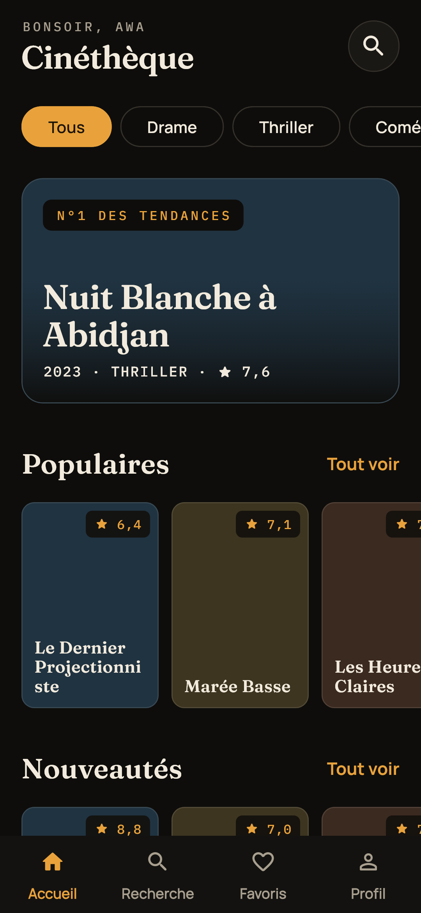
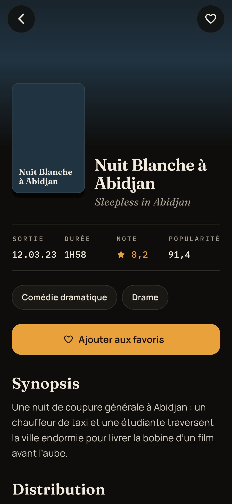
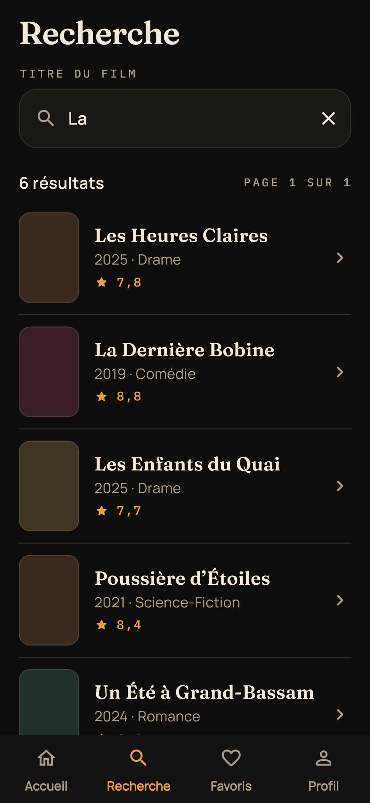
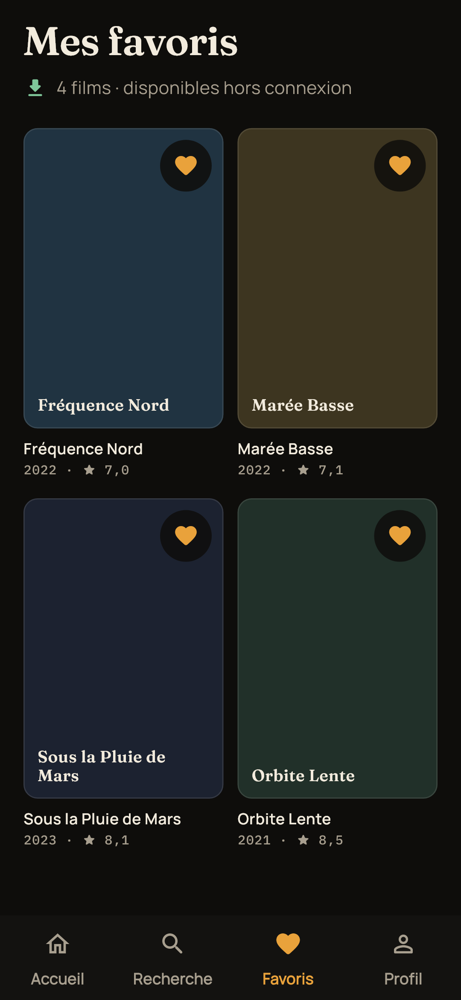
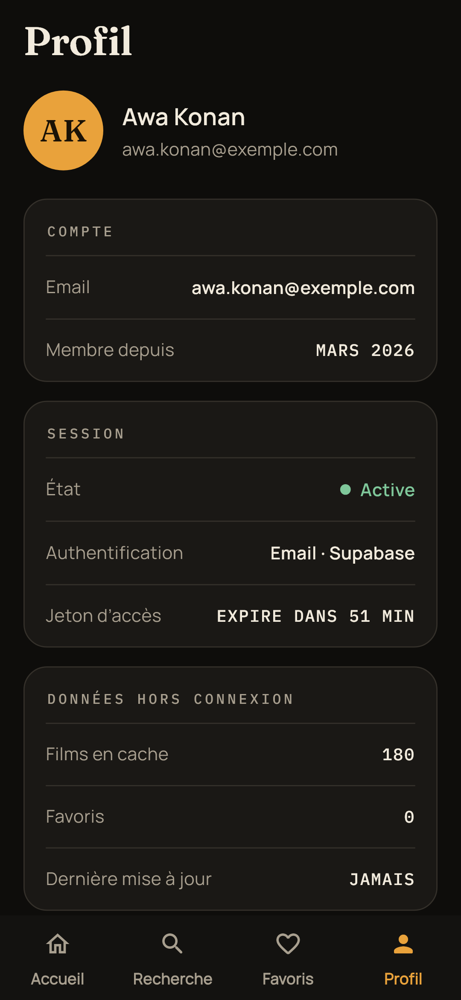
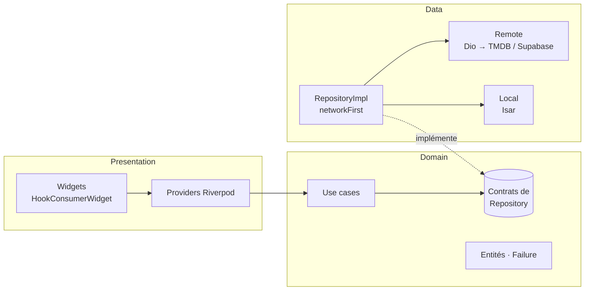
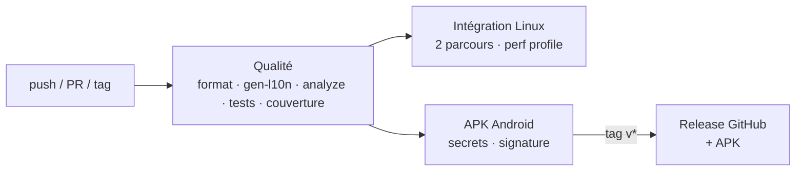

# Cinéthèque

[](https://github.com/angekougo/flutter_app_production_ready/actions/workflows/ci.yml)


[](https://github.com/angekougo/flutter_app_production_ready/releases/latest)

> Application mobile Flutter de découverte de films — **TMDB**, **Supabase Auth**,
> **cache Isar hors ligne** — portée au niveau **production** : testée de bout en
> bout, mesurée à 60 fps, accessible, bilingue, livrée par CI/CD.

Projet final de la certification **« Flutter — App production-ready testée et
optimisée »**, construit à partir de [Cinéthèque 1.0](https://github.com/angekougo/cinetheque)
(certification « App connectée avec backend réel »).

**📱 [Télécharger l'APK de démonstration](https://github.com/angekougo/flutter_app_production_ready/releases/latest)**

| Accueil | Fiche film | Recherche | Favoris | Profil |
|:---:|:---:|:---:|:---:|:---:|
|  |  |  |  |  |

<sub>Captures générées depuis l'application réelle (thème, polices, traductions),
avec un backend de démonstration : les affiches TMDB y sont remplacées par leurs
vignettes colorées. Voir [Captures d'écran](#11-commandes).</sub>

---

## Sommaire

1. [Exigences de la certification](#1-exigences-de-la-certification)
2. [Fonctionnalités](#2-fonctionnalités)
3. [Architecture](#3-architecture)
4. [Tests](#4-tests)
5. [Performance](#5-performance)
6. [Accessibilité](#6-accessibilité)
7. [Internationalisation](#7-internationalisation)
8. [CI/CD](#8-cicd)
9. [Préparation à la production](#9-préparation-à-la-production)
10. [Installation](#10-installation)
11. [Commandes](#11-commandes)
12. [Limites connues](#12-limites-connues)

---

## 1. Exigences de la certification

| Exigence | Réalisation | Preuve |
|---|---|---|
| Au moins 5 écrans | **10 écrans** : démarrage, connexion, inscription, accueil, « Tout voir », recherche, fiche film, fiche acteur, favoris, profil | [`lib/features/*/presentation/pages`](lib/features) |
| ≥ 10 tests unitaires | **87** (logique métier, validateurs, repositories, providers, traductions, contraste) | [`test/`](test) |
| ≥ 5 tests de widgets | **39** (écrans, accessibilité, reconstructions, changement de langue) | [`test/`](test) |
| ≥ 2 tests d'intégration | **2 parcours + 1 mesure de performance** sur l'app complète | [`integration_test/`](integration_test) |
| Aucun jank (60 fps) | Défilement mesuré en mode profile en CI : **p90 4,55 ms, 0 image hors budget** sur 350 (seuils : 16 ms, 5 %) | [§ 5](#5-performance) |
| Images optimisées et lazy-loadées | Taille TMDB et décodage adaptés à l'affichage, cache disque, listes `builder` | [§ 5](#5-performance) |
| Pas de rebuilds inutiles | **flutter_hooks** + `select` + égalité par valeur ; reconstructions **mesurées** par des tests | [`test/performance/`](test/performance) |
| Semantic labels | Libellés sur tous les éléments interactifs, en-têtes, zones live ; règles Flutter vérifiées sur 6 écrans | [§ 6](#6-accessibilité) |
| FR + EN | `flutter gen-l10n`, 173 textes, choix de langue persistant | [`lib/l10n/`](lib/l10n) |
| CI lint + tests | GitHub Actions : format, analyse, tests, intégration Linux, APK | [`.github/workflows/ci.yml`](.github/workflows/ci.yml) |
| `flutter analyze` propre | `--fatal-infos --fatal-warnings` en CI, 30+ règles de lint | [`analysis_options.yaml`](analysis_options.yaml) |
| README, CHANGELOG | Ce document, [CHANGELOG.md](CHANGELOG.md) (3 versions) | — |
| APK de démonstration | Construit et signé par la CI, attaché à chaque release | [Releases](https://github.com/angekougo/flutter_app_production_ready/releases) |

## 2. Fonctionnalités

| Écran | Contenu | Données |
|---|---|---|
| **Démarrage** | Restaure la session, redirige vers l'accueil ou la connexion | Supabase (session locale chiffrée) |
| **Connexion / Inscription** | Validation, jauge de robustesse, confirmation, erreurs traduites | Supabase Auth |
| **Accueil** | N°1 des tendances, Populaires, Nouveautés, Tendances, filtres par genre | TMDB → cache Isar |
| **Tout voir** | Grille paginée à défilement infini | TMDB → cache Isar |
| **Recherche** | Anti-rebond, pagination, recherches récentes | TMDB → cache Isar |
| **Fiche film** | Sortie, durée, note, popularité, genres, synopsis, casting, similaires, favori | TMDB → cache Isar |
| **Fiche acteur** | Portrait, naissance, biographie, filmographie | TMDB → cache Isar |
| **Favoris** | Grille, retrait avec « Annuler », disponibles hors ligne | Isar, par utilisateur |
| **Profil** | Compte, session (expiration du JWT), données hors ligne, **langue**, déconnexion | Supabase REST (Dio + JWT) + Isar |

**Hors ligne** : stratégie « réseau d'abord, cache en secours » ; tout ce qui a été
consulté reste disponible, avec une bannière et la date de mise à jour.

## 3. Architecture

**Clean Architecture feature-first** : chaque fonctionnalité a ses couches
`data` / `domain` / `presentation`. Le domaine est en Dart pur et **ne contient
aucun texte affiché** (les erreurs sont des types, traduits par la présentation).



```text
lib/
├── main.dart               # .env, polices embarquées, Supabase, Isar, préférences
├── app/                    # Thème, routeur (GoRouter + garde de session), polices
├── core/
│   ├── error/              # AppException → Failure (types, sans texte)
│   ├── l10n/               # Langue choisie / appareil, résolution FR-EN
│   ├── network/            # Dio, intercepteurs TMDB (langue) et JWT, tailles d'images
│   ├── repository/         # Stratégie networkFirst réutilisée partout
│   └── storage/            # Isar, session chiffrée
├── features/{auth,home,movies,actors,favorites,profile}/
│   ├── data/               # DataSources, modèles, RepositoryImpl
│   ├── domain/             # Entités, contrats, use cases
│   └── presentation/       # Providers, pages, widgets
├── l10n/                   # app_fr.arb (modèle), app_en.arb + code généré
└── shared/                 # Widgets (StarText, PosterCard…), extensions (l10n, images)
```

| Brique | Rôle |
|---|---|
| **Riverpod 3 + hooks_riverpod** | Injection de dépendances, état, `select` pour des reconstructions ciblées |
| **flutter_hooks** | État local des widgets (contrôleurs, animations) sans `StatefulWidget` |
| **GoRouter** | Onglets persistants, redirection automatique selon la session |
| **Dio** | Client TMDB (clé applicative, langue) et client Supabase (JWT + refresh) |
| **Isar** | Cache hors ligne et favoris |
| **flutter_localizations / intl** | Traductions ARB, pluriels, formats de nombres et de dates |

## 4. Tests

| Type | Nombre | Contenu |
|---|---:|---|
| Unitaires | 87 | Validateurs, repositories (réseau/cache/erreurs), intercepteur JWT, contrôleur de recherche, traductions et formats, langue, tailles d'images, contraste WCAG |
| Widgets | 39 | Écrans (états chargement/succès/hors ligne/erreur), accessibilité, reconstructions, changement de langue |
| Intégration | 3 | 2 parcours utilisateur + 1 mesure de performance, sur l'app complète |

**140 cas exécutés** par `flutter test` (certains tests sont paramétrés), **81 %
de couverture** hors code généré. Les parcours d'intégration sont aussi rejoués
en temps simulé dans `flutter test` ([`test/e2e/`](test/e2e)).

Les tests d'intégration lancent la **vraie application** (routeur, thème,
traductions) avec un **backend en mémoire** ([`fake_backend.dart`](integration_test/support/fake_backend.dart)) :
reproductibles, sans réseau ni compte.

1. **Favori** : mauvais mot de passe → erreur ; bon mot de passe → accueil →
   fiche du n°1 → ajout aux favoris → onglet Favoris → retrait → « Annuler ».
2. **Recherche, langue, déconnexion** : session restaurée → recherche avec
   anti-rebond (un seul appel) → fiche → Profil → anglais → déconnexion.

## 5. Performance

### Mesures (CI, mode profile, défilement de l'accueil et d'une grille de 60 affiches)

<!-- PERF:START -->
| Mesure | Résultat | Budget 60 fps |
|---|---:|---:|
| Images analysées | 350 | — |
| Construction moyenne | **1,89 ms** | 16 ms |
| 90ᵉ centile | **4,55 ms** | < 16 ms |
| 99ᵉ centile | **6,72 ms** | — |
| Images hors budget | **0** | < 5 % |

<sub>Run CI du commit `57d56c3`. Mesures republiées à chaque exécution dans le résumé du job
« Tests d'intégration (Linux) » ([exécutions](https://github.com/angekougo/flutter_app_production_ready/actions/workflows/ci.yml)).</sub>
<!-- PERF:END -->

Le test échoue si le **90ᵉ centile du temps de construction dépasse 16 ms** ou si
**plus de 5 % des images** dépassent le budget d'une image à 60 fps.

### Reconstructions (mesurées par [`rebuilds_test.dart`](test/performance/rebuilds_test.dart))

| Situation | Avant | Après | Technique |
|---|---:|---:|---|
| Saisie à l'inscription (écran reconstruit) | 3 | **0** | Hooks ; seuls la jauge et la confirmation écoutent les champs |
| Saisie dans la recherche | 1 / caractère | **0** | Bouton « Effacer » et aide abonnés au champ seulement |
| Rafraîchissement du JWT (accueil) | 1 | **0** | `select` sur le prénom + égalité par valeur (`Fetched`, `HomeOverview`) |
| Pulsation des squelettes (60 fps) | 60 builds/s/bloc | **0** | `FadeTransition` + `RepaintBoundary` |
| Horloge du Profil (30 s) | écran entier | **3 valeurs** | Widget `_Clocked` isolé |

### Images

- Taille TMDB choisie selon les **pixels réellement affichés** (`w154` → `w500`
  pour les affiches, `w300` → `w1280` pour les fonds).
- Décodage à la taille affichée (`memCacheWidth` = largeur × densité d'écran).
- Cache disque (`cached_network_image`) et listes construites à la demande
  (`ListView.builder`, `SliverGrid.builder`), y compris le casting complet.

Et partout : widgets `const` imposés par le lint (`prefer_const_*`,
`use_colored_box`, `use_decorated_box`…).

## 6. Accessibilité

- **Libellés** : chaque affiche, carte ou membre du casting est **un bouton** au
  résumé explicite — « *Marée Basse, 2024, Thriller, note 7,9 sur 10* » — sans
  doublon ni symbole lu tel quel.
- **Structure** : titres d'écrans et de sections déclarés comme en-têtes ;
  bannière hors ligne en zone live ; état du favori (activé / désactivé) ;
  chargement annoncé.
- **Cibles tactiles** ≥ 48 dp ; libellés courts sur une ligne.
- **Contraste** : toutes les couleurs de texte ≥ 4,5:1 (WCAG AA) sur tous les
  fonds — minimum 5,2:1 ([`color_contrast_test.dart`](test/a11y/color_contrast_test.dart)).
- **Vérifié** par les règles d'accessibilité de Flutter sur 6 écrans et par des
  tests des libellés en français et en anglais ([`test/a11y/`](test/a11y)).

## 7. Internationalisation

- **Français et anglais** : [`app_fr.arb`](lib/l10n/app_fr.arb) (modèle) et
  [`app_en.arb`](lib/l10n/app_en.arb), code généré par `flutter gen-l10n`.
- **Pluriels et accords en ICU** : « 1 résultat / 12 résultats »,
  « NÉE / NÉ / NÉ·E LE … ».
- **Formats selon la langue** : 7,9 / 7.9 ; 12.03.24 / 03/12/24 ; « il y a 5 min » / « 5 min ago ».
- **Langue de l'appareil par défaut**, choix persistant dans le Profil ; les
  **contenus TMDB** (titres, synopsis, genres) suivent la langue.
- Le domaine ne contient aucun texte : erreurs et validations sont des types,
  traduits dans [`l10n_x.dart`](lib/shared/extensions/l10n_x.dart).

## 8. CI/CD



| Job | Étapes |
|---|---|
| **Qualité** | `dart format --set-exit-if-changed`, traductions générées à jour, `flutter analyze --fatal-infos --fatal-warnings`, `flutter test --coverage` (résumé de couverture) |
| **Intégration (Linux)** | Parcours sur bureau Linux (xvfb) puis `flutter drive --profile` pour la performance (résumé JSON en artefact et en annotation) |
| **APK Android** | `.env` et keystore injectés depuis les **secrets** du dépôt, `flutter build apk --release`, APK en artefact ; release GitHub sur les tags `v*` |

Les échecs sont publiés en **annotations** ([`tool/ci/run.sh`](tool/ci/run.sh)) :
l'erreur se lit depuis la page du run.

## 9. Préparation à la production

- **Secrets hors du code** : `.env` ignoré par git ; la CI le reconstruit depuis
  les secrets `TMDB_READ_TOKEN`, `SUPABASE_URL`, `SUPABASE_PUBLISHABLE_KEY`. Seules
  des clés **publiques** côté client (jeton TMDB en lecture, clé *publishable*
  Supabase, protégée par RLS) sont embarquées.
- **Android** : permission `INTERNET` déclarée pour la release, identifiant
  `io.github.angekougo.cinetheque`, signature de release via `key.properties`
  (secrets `ANDROID_KEYSTORE_BASE64`, `ANDROID_KEYSTORE_PASSWORD`,
  `ANDROID_KEY_ALIAS`, `ANDROID_KEY_PASSWORD`).
- **Polices embarquées** avec leurs licences OFL : aucun téléchargement au
  premier lancement, affichage identique hors ligne.
- **Session** chiffrée (Keystore / Keychain), JWT rafraîchi automatiquement.

## 10. Installation

**Prérequis** : Flutter 3.47+ (Dart 3.13+), un appareil ou émulateur Android/iOS.

```bash
git clone https://github.com/angekougo/flutter_app_production_ready.git
cd flutter_app_production_ready
cp .env.example .env    # puis renseigner les trois clés
flutter pub get
flutter run
```

| Variable `.env` | Où la trouver |
|---|---|
| `TMDB_READ_TOKEN` | themoviedb.org → Paramètres → API → *Jeton d'accès en lecture* |
| `SUPABASE_URL` | Supabase → Project Settings → Data API |
| `SUPABASE_PUBLISHABLE_KEY` | Supabase → Project Settings → API Keys (`sb_publishable_…`) |

## 11. Commandes

```bash
flutter analyze                          # analyse statique
flutter test --coverage                  # tests unitaires et de widgets
flutter test integration_test -d <appareil>   # parcours de bout en bout

# Performance (mesures fiables uniquement en mode profile)
flutter drive --profile --driver=test_driver/perf_driver.dart \
  --target=integration_test/scroll_performance_test.dart -d <appareil>

# Captures d'écran du README (docs/screenshots)
flutter test tool/screenshots --update-goldens

flutter gen-l10n                         # après modification des fichiers .arb
dart run build_runner build              # après modification des modèles Isar
```

## 12. Limites connues

- **iOS** : non signé ni distribué (pas de compte Apple Developer) ; le code est
  compatible, seul l'APK Android est livré.
- **Cache et langue** : les données en cache gardent la langue dans laquelle
  elles ont été téléchargées, jusqu'à leur prochain rafraîchissement en ligne.
- **Mesures de performance** effectuées sur le bureau Linux de la CI (rendu
  logiciel) : elles valident le temps de construction des images ; le temps de
  rendu GPU se vérifie sur appareil (DevTools, mode profile).

---

<sub>Ce produit utilise l'API TMDB mais n'est ni approuvé ni certifié par TMDB.
Polices Manrope, Fraunces et IBM Plex Mono sous licence SIL Open Font License.</sub>
